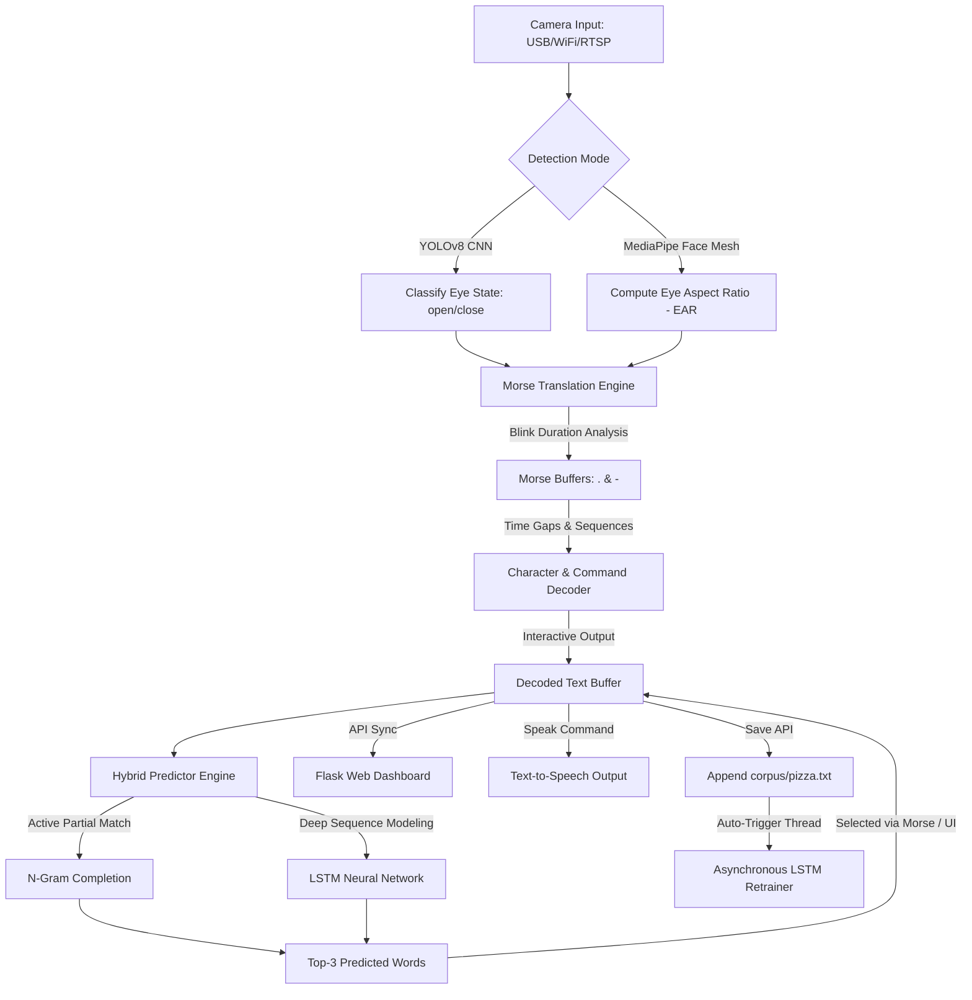

# 👁️ AI-Powered Blink Morse & Predictive AAC System

[](https://www.python.org/)
[](https://flask.palletsprojects.com/)
[](https://ultralytics.com/)
[](https://google.github.io/mediapipe/)
[](https://www.tensorflow.org/)

An advanced **Augmentative and Alternative Communication (AAC)** assistive technology platform designed for individuals with motor impairments, paralysis, ALS, or locked-in syndrome. By fusing state-of-the-art computer vision (YOLOv8 & MediaPipe) with robust NLP (N-Gram & LSTM), this system allows users to seamlessly type, predict text, command speech synthesis, and trigger emergency alerts—all through natural eye blinks.

---

## 🌟 Key Features

*   **Dual Tracking Modalities**:
    *   **YOLOv8 Mode (Custom CNN)**: Employs a lightweight, custom-trained YOLOv8 model (`best.pt`) to identify and track eye regions, classifying their states (*open* vs. *close*) with ultra-low latency.
    *   **MediaPipe Mode (Landmark EAR)**: Uses a 468-point 3D Face Mesh to calculate the **Eye Aspect Ratio (EAR)** for highly precise geometric blink tracking. Includes automatic baseline calibration.
*   **Intelligent Morse Translation Engine**:
    *   Converts blink hold durations into Morse signals (short blinks = `.` / long holds = `-`).
    *   Employs highly tuned time thresholds for automatic letter space commits (`LETTER_GAP`) and word transitions.
    *   Fully customizable shortcuts for structural actions (spaces, backspaces, text clearing).
*   **Dual-Layer NLP Predictive Typist**:
    *   **N-Gram Model**: Quick, zero-cold-start predictive model for instant word completions and next-word suggestions.
    *   **LSTM Neural Network**: Deep contextual sequence predictor built using TensorFlow. Safe to run on CPU and performs background training.
    *   **Real-time Learning**: Actively learns from user input. Newly logged sentences are automatically added to the training corpus and asynchronously train the LSTM.
*   **Interactive Web-Based Dashboard**:
    *   Real-time video feed streaming directly to your browser with overlay visualizations (bounding boxes, face landmarks, live Morse buffer, and typed sentences).
    *   Full suite of API endpoints to sync typed text, control camera feeds, and query prediction engines.
    *   Integrated Speech Synthesizer: Instantly vocalize completed sentences via Morse commands or web interface actions.
*   **YOLO Training Visualization Portal**:
    *   Dedicated interface displaying detailed training metrics (`/training-graphs`) directly parsed from model checkpoints (Box/Classification/DFL loss, Precision, Recall, mAP50, and mAP50-95 curves).

---

## 🏛️ System Architecture



---

## 📋 Morse & Command Mapping Cheat-Sheet

The system is equipped with direct hotkeys and abbreviations designed for rapid communication and hands-free control:

### ⚙️ Action & Structural Shortcuts

| Morse Command | Action Type | System Behavior |
| :--- | :--- | :--- |
| `.....` | Space | Inserts a blank space between words. |
| `......` | Backspace | Deletes the last character in the buffer. |
| `----` or `..--` | Clear All | Wipes both the decoded text and the Morse buffer. |
| `.-.-.` | Speak | Vocalizes the current text buffer out loud and clears it. |
| `...---...` | SOS / Emergency | Triggers a critical UI alert and speaks: *"EMERGENCY! HELP NEEDED!"* |
| `....-` | Suggestion #1 | Commits the 1st word prediction suggestion (*selectable during active typing*). |
| `-....` | Suggestion #2 | Commits the 2nd word prediction suggestion. |
| `--...` | Suggestion #3 | Commits the 3rd word prediction suggestion. |

### 🚨 Medical & Quick-Comfort Abbreviations

Typing the following abbreviations and pausing for the `WORD_GAP` automatically expands the text into complete emergency phrases and speaks them aloud:

*   **`INH`** ➜ `HELP! ` *(Triggers Emergency Alert)*
*   **`DR`**  ➜ `NEED DOCTOR! ` *(Triggers Emergency Alert)*
*   **`EM`**  ➜ `SOS! ` *(Triggers Emergency Alert)*
*   **`WP`**  ➜ `WATER ` *(Triggers Speech)*
*   **`FD`**  ➜ `FOOD ` *(Triggers Speech)*
*   **`Y`**   ➜ `YES ` *(Triggers Speech)*
*   **`N`**   ➜ `NO ` *(Triggers Speech)*

---

## 📁 Repository Structure

```
├── app.py                      # Main Flask application hosting the AAC Dashboard
├── auto_blink_system.py        # MediaPipe blink system integration wrapper
├── best.pt                     # Custom YOLOv8 model weights for open/closed eye classification
├── blink_app.py                # MediaPipe FaceMesh EAR Blink Demo App (Port 5001)
├── blink_detector.py           # Core MediaPipe Face Mesh process & calibration engine
├── camera_morse.py             # YOLOv8 Camera Capture, Morse Decoder & UI overlay engine
├── evaluate_yolo.py            # Utility script to inspect YOLOv8 validation metrics
├── lstm.h5                     # Saved Keras LSTM model for word predictions
├── next_word_predictor.py      # Core Word Prediction Engine (N-Gram + CPU-optimized LSTM)
├── ngram_model.pkl             # Serialized N-Gram model vocabulary
├── requirements.txt            # Python dependencies
├── start.sh                    # Shell script to activate virtual environment and start main app
├── start_blink_detector.sh     # Shell script to set up packages and run MediaPipe demo
├── static/
│   ├── css/
│   │   └── index.css           # Custom CSS styling for premium Web UI
│   └── image.png               # Graphical UI asset
├── templates/
│   ├── blink_demo.html         # HTML template for the MediaPipe EAR demo
│   ├── index.html              # Main Flask Web Dashboard HTML template
│   └── training_graphs.html    # YOLOv8 checkpoint analytics visualizer
├── tokenizer.pkl               # Tokenizer mapping saved during LSTM training
├── train_lstm.py               # Standalone utility to retrain the LSTM predictor
└── .env                        # Environment configurations (camera, API keys)
```

---

## 🚀 Installation & Setup

### 1. Clone the Repository
```bash
git clone https://github.com/your-username/blink-predictive-aac.git
cd blink-predictive-aac
```

### 2. Set Up Virtual Environment
Create a virtual environment to ensure dependency isolation:
```bash
python3 -m venv venv
source venv/bin/activate
```

### 3. Install Dependencies
```bash
pip install -r requirements.txt
```
*(Alternatively, for MediaPipe Mode, run `pip install mediapipe numpy scipy`)*

---

## ⚙️ Environment Configuration

Create or modify the `.env` file in the root of the project to manage input configurations:

```env
# Google Gemini API key (Optional)
GOOGLE_API_KEY=your_gemini_api_key_here

# ─── Camera Source Options ───────────────────────────────────────────
# Leave blank to automatically select the first working USB webcam
CAMERA_SOURCE=

# Examples:
# CAMERA_SOURCE=0                              # Standard local webcam (Index 0)
# CAMERA_SOURCE=http://192.168.1.100:8080/video # DroidCam / IP Camera stream
# CAMERA_SOURCE=rtsp://192.168.1.100:554/stream # ESP32-CAM or IP Camera RTSP feed
```

---

## 💻 Running the Application

### Option A: Main YOLOv8 Web Dashboard (Recommended)
This launches the complete AAC workspace equipped with the customized YOLOv8 model, Morse conversion engines, hybrid predictive suggestions, dynamic text saving, and retraining features.

```bash
# Using the pre-configured script:
chmod +x start.sh
./start.sh

# Or run manually:
source venv/bin/activate
python app.py
```
*   **Dashboard URL**: `http://localhost:5000`
*   **Metrics Panel**: `http://localhost:5000/training-graphs`

### Option B: MediaPipe EAR Demo App
This launches the standalone MediaPipe Landmark Face Mesh client which calculates real-time Eye Aspect Ratio (EAR) metrics, count blinks, and performs automated calibration.

```bash
# Using the pre-configured script:
chmod +x start_blink_detector.sh
./start_blink_detector.sh

# Or run manually:
source venv/bin/activate
python blink_app.py
```
*   **Demo URL**: `http://localhost:5001`

---

## 🧠 Training & Predictive Customization

### The Dynamic LSTM Neural Network
The sequence prediction models are trained on text patterns loaded from the `corpus/` directory. 
*   **Automatic Retraining**: When writing text via the Web interface and clicking **Save**, the system cleans the text, appends it to `corpus/pizza.txt`, learns new vocabulary in the N-Gram model instantly, and schedules background LSTM retraining once `min_samples` (20 new sentences) are accrued.
*   **Manual Retraining**: You can manually trigger training to rebuild `lstm.h5` and `tokenizer.pkl` on customized text corpora:
```bash
python train_lstm.py --epochs 100
```

---

## 📊 Visual Model Analytics
Navigate to `/training-graphs` on the Flask server to view the performance metrics of the custom YOLOv8 model checkpoint. The metrics are generated dynamically on load from `best.pt`:
*   **Box Loss, Classification Loss, and DFL Loss** curves.
*   **mAP50** and **mAP50-95** indicators.
*   Learning rate decay schedules and training configuration information.

---

## 🛡️ License & Acknowledgements

*   Developed as a fully integrated **Assistive augmentative communication** workspace.
*   Special thanks to **Ultralytics** (YOLOv8 framework) and **Google MediaPipe** for the visual detection models.
*   Licensed under the [MIT License](LICENSE).
